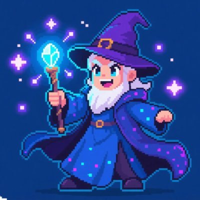

<div align="center">
  
  <h1>FieldPump</h1>
  <p><strong>A pixel-style MMORPG that combines exploration, combat, and co-building in the Web3 world</strong></p>
  <p>
    <a href="http://fieldspump.onl/" target="_blank">Official Website</a> ·
    <a href="https://x.com/FieldPump" target="_blank">Twitter</a>
  </p>
</div>

## 🌍 Project Overview

FieldPump emerges as a retro pixel-style Web3 Massively Multiplayer Online Role-Playing Game (MMORPG), blending high playability with deep social connectivity. By offering an open-world adventure, real-time multiplayer interactions, and decentralized mechanisms, FieldPump delivers a nostalgic yet innovative MMO experience. Players shape a vibrant virtual "Field," driving value and enjoyment through exploration and community collaboration (the "Pump").

### Core Principles

- **Immersive Playability**: Diverse gameplay through open-world exploration, questlines, skill trees, and dynamic events, catering to casual and hardcore players alike
- **Social Connectivity**: Real-time multiplayer interactions, guild collaboration, and community events to build a tight-knit virtual society
- **Decentralized Freedom**: Blockchain integration granting players true ownership of assets and influence over the game's evolution via community governance

## 🎮 Gameplay Features

### High Playability: Adventure and Challenge

- **Open-World Sandbox**: Expansive pixel maps featuring forests, dungeons, volcanoes, and more, each with unique NPCs, quests, and hidden treasures
- **Questlines and Narrative**: Robust questlines with branching narratives where player choices shape quest outcomes
- **Combat and Skill Trees**: Real-time combat system with customizable skill trees for strategic builds
- **Gear and Crafting**: Deep gear system supporting upgrades, enchantments, and gem socketing for personalized equipment
- **PvP and Competitive Play**: Arena battles and large-scale guild wars for territory control

### Multiplayer Social Experience

- **Real-Time Multiplayer**: Supports hundreds of players per server with real-time voice, text chat, and emote systems
- **Guilds and Teamwork**: Form or join guilds for exclusive quests, territory battles, and leaderboard competitions
- **Trading and Markets**: Player-driven markets where gear, items, and NFTs are traded based on supply and demand
- **Community Events**: Seasonal festivals and player-hosted events offering exclusive quests and rewards

### Web3 Integration

- **Asset Ownership**: NFTs enable players to own unique gear, skins, or virtual land
- **Decentralized Governance**: DAO allows players to vote on game updates, event rules, and community initiatives
- **Seamless Interaction**: Wallet-based logins and on-chain marketplaces streamline blockchain integration

## 🛠️ Technical Architecture

### Game Framework

- **Frontend**: HTML5 Canvas and TypeScript for smooth 2D pixel rendering, compatible with browsers and mobile devices
- **Backend**: Node.js-powered, leveraging µWebSockets for high-concurrency real-time communication
- **Core Modules**: Map Engine, Quest System, Combat Module, Social Framework, and Market System

### Web3 Integration

- **Blockchain Platform**: Polygon or BNB Chain for low gas fees and fast transactions
- **NFT Mechanisms**: Gear NFTs, Social NFTs, and Land NFTs
- **Smart Contracts**: Decentralized marketplace and governance DAO
- **Wallet Integration**: MetaMask and WalletConnect for seamless login and asset management

## 🚀 Getting Started

### Prerequisites

- Node.js (v16+)
- MongoDB
- MetaMask browser extension (for Web3 features)

### Installation

```bash
# Clone the repository
git clone https://github.com/yourusername/fieldpump.git

# Install dependencies
npm install

# Set up environment variables
cp .env.example .env
# Edit .env with your configuration

# Start development server
npm run dev

# In another terminal, start the client
npm run client
```

## 📂 Project Structure

```
/
├── client/               # Frontend code
│   ├── assets/           # Game assets (sprites, sounds)
│   ├── src/              # Source code
│   │   ├── components/   # UI components
│   │   ├── game/         # Game engine and logic
│   │   ├── web3/         # Blockchain integration
│   │   └── index.ts      # Entry point
│   └── index.html        # HTML template
├── server/               # Backend code
│   ├── controllers/      # Request handlers
│   ├── models/           # Database models
│   ├── routes/           # API routes
│   ├── services/         # Business logic
│   ├── websocket/        # Real-time communication
│   └── index.js          # Entry point
└── shared/               # Shared code between client and server
    └── types/            # TypeScript type definitions
```

## 🗓️ Development Roadmap

- **Q2-Q3 2025**: Project Kickoff - Core mechanics development, Web3 integration, and community building
- **Q4 2025**: Alpha Testing - Feature rollout with quests, dungeons, guilds, and NFT trading
- **Q1 2026**: Beta Release - Land NFTs, player creation tools, and DAO governance launch
- **Q2 2026 and Beyond**: Full Launch - Complete quest systems, guild wars, and cross-server leagues

## 🤝 Join the Adventure

FieldPump is more than a game—it's a community-driven ecosystem where your contributions shape the world. Whether you're an adventurer, builder, trader, or social connector, there's a place for you in our pixel universe.

Visit our [official website](http://fieldspump.onl/) or follow us on [Twitter](https://x.com/FieldPump) to stay updated on the latest developments and join our growing community.

## 📜 License

MIT